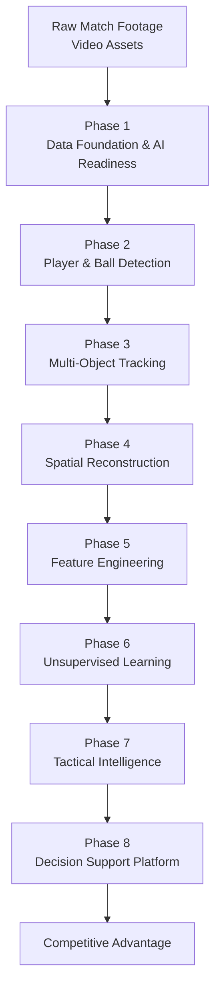
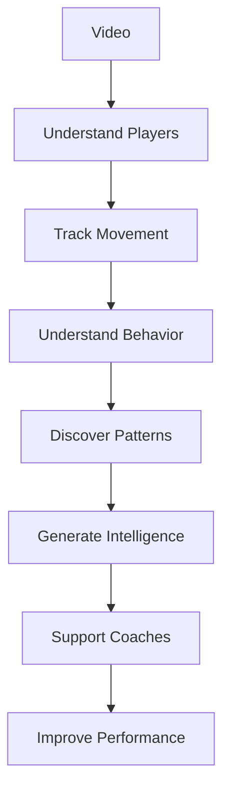

# Water Polo AI Project
## End-to-End System Flow

---

## Executive Summary

The objective of this project is to transform raw water polo match footage into actionable tactical intelligence that can support elite coaching decisions.

The system evolves through eight major phases:



---

# Phase 0
## Raw Match Footage

### Purpose

Collect match recordings that will serve as the primary source of information.

### Output

- Raw Water Polo Videos

### Business Meaning

The project begins with video assets captured during matches.

---

# Phase 1
## Data Foundation & AI Readiness

### Objectives

- Video Cataloguing
- Metadata Extraction
- Quality Assessment
- Normalization
- Pipeline Automation

### Questions Answered

✅ Do we have data?

✅ Is the data usable?

✅ Is the quality sufficient?

✅ Can preprocessing be automated?

### Outputs

- Video Inventory
- Metadata Database
- Quality Metrics
- Standardized Videos
- Operational Pipeline

### Business Meaning

> We validated that the foundation exists for AI development.

---

# Phase 2
## Player & Ball Detection

### Objective

Detect players and the ball in every frame.

### Potential Technologies

- YOLO
- RT-DETR
- Faster R-CNN

### Input

- Video Frames

### Output

- Player Bounding Boxes
- Ball Bounding Boxes

### Business Meaning

> We know where objects are.

---

# Phase 3
## Multi-Object Tracking

### Objective

Maintain identities across frames.

### Potential Technologies

- DeepSORT
- ByteTrack

### Input

- Detected Objects

### Output

- Player Trajectories
- Ball Trajectories

### Business Meaning

> We know who is moving.

---

# Phase 4
## Spatial Reconstruction

### Objective

Transform image coordinates into real-world pool coordinates.

### Technology

- Homography

### Input

Pixel Coordinates

Example:

```text
(725, 412)
```

### Output

Pool Coordinates

Example:

```text
(12.4m, 6.8m)
```

### Business Meaning

> We know where players are inside the pool.

---

# Phase 5
## Feature Engineering

### Objective

Convert trajectories into measurable performance metrics.

### Potential Features

- Swimming Distance
- Velocity
- Acceleration
- Direction Changes
- Occupancy Maps
- Space Utilization

### Input

- Player Trajectories

### Output

- Performance Metrics

### Business Meaning

> We know what players are doing.

---

# Phase 6
## Unsupervised Learning

### Objective

Discover tactical patterns automatically.

### Potential Algorithms

- K-Means
- DBSCAN
- HDBSCAN

### Input

- Movement Features

### Output

- Tactical Pattern Clusters

### Example Discoveries

- Counterattack Pattern A
- Counterattack Pattern B
- Defensive Pattern A
- Offensive Formation B

### Business Meaning

> We know recurring tactical behaviors.

---

# Phase 7
## Tactical Intelligence

### Objective

Translate patterns into actionable coaching insights.

### Outputs

- Heatmaps
- Formation Analysis
- Transition Analysis
- Defensive Compactness
- Space Creation Analysis
- Opponent Intelligence

### Business Meaning

> We know why teams perform the way they do.

---

# Phase 8
## Decision Support Platform

### Objective

Deliver intelligence directly to coaches.

### Outputs

- Dashboards
- Tactical Reports
- Match Reviews
- Performance Reports

### Business Meaning

> We enable faster and better coaching decisions.

---

# End-to-End Value Chain


---

# Executive Narrative



---

# One-Sentence Project Definition

> Transforming raw match footage into tactical intelligence and competitive advantage through AI, Computer Vision, and Behavioral Analytics.
